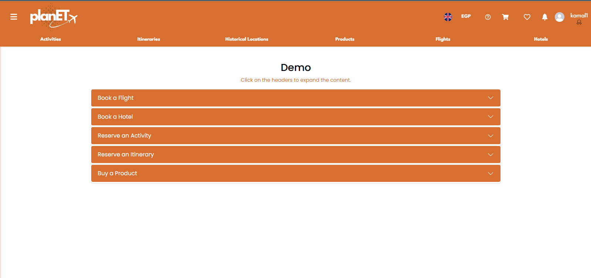

# planET

In today's world, it is often confusing to plan out a trip, requiring one to visit multiple different sites and to carefully cross-reference details between different companies. We aim to fix these issues, by simplifying the process of planning out a perfect trip, organizing itineraries, historical places, and activities in any and all countries one might want to visit all in one place. With real-time suggestions, integration with maps, and a user-friendly interface, we hope to transform how people discover and experience new places and countries.
This project uses the MERN stack.

## Table of Contents

- [Build Status](#build-status)
- [Tech/Framework](#tech-stack)
- [Code Style](#code-style)
  - [General Coding Guidelines](#general-guidelines)
  - [Front-End (React)](#front-end-react)
      - [Components](#components)
      - [Hooks](#hooks)
      - [Services](#frontend-services)
      - [Store](#store)
      - [Utils](#utils)
      - [Views](#views)
  - [Back-End (Node.js & Express)](#back-end-nodejs--express)
    - [Folder Structure](#folder-structure)
    - [Routing](#routing)
    - [Controller Functions](#controller-functions)
    - [Services](#services)
    - [Dependency Injections](#dependency-injections)
    - [Interfaces](#interfaces)
    - [Middleware](#middleware)
    - [Error Handling](#error-handling)
  - [Database (MongoDB)](#database-mongodb)
    - [Schema Design](#schema-design)
    - [Queries & Aggregations](#queries--aggregations)
- [Testing](#testing)
  - [Backend Testing (Postman)](#backend-testing-postman)
  - [Example of Postman Request](#example-postman-request-postman)
- [Screenshots](#screenshots)
- [Features](#features)
  - [Features For Tourists](#features-for-tourists)
  - [Features For Admins](#features-for-admins)
  - [Features For Advertisers](#features-for-advertisers)
  - [Features For Tour Guide](#features-for-tour-guides)
  - [Features For Sellers](#features-for-sellers)
  - [Features For Tourism Governor](#features-for-tourism-governor)
- [Installation](#installation)
- [How to Use](#how-to-use)
- [API References](#api-references)
- [Contributions](#contributions)
- [Credits](#credits)
- [License](#license)

## Build Status


This project uses GitHub Actions for continuous integration. The badges above reflect the current build status of the frontend and backend respectively in the `main` branch.

## Tech Stack

This project is built using the **MERN** stack, which consists of the following technologies:

- **MongoDB**: A NoSQL database used for storing and managing data. It stores data in a flexible, JSON-like format, making it ideal for handling large amounts of unstructured data.
- **Express.js**: A web application framework for Node.js, used to handle HTTP requests, routing, and middleware. It provides a robust set of features to build web and mobile applications.
- **React.js**: A JavaScript library for building user interfaces. React allows for creating dynamic, single-page applications (SPAs) with a component-based architecture.
- **Node.js**: A JavaScript runtime environment that executes JavaScript code outside of a browser. Node.js allows for building scalable network applications and is the backend runtime for this project.

- **TypeScript**: A superset of JavaScript that adds static types. TypeScript helps in building more robust and maintainable code, providing features like type checking, interfaces, and better tooling support during development.

### Additional Technologies/Tools

- **Redux**: A state management library for React applications, helping manage global state in a predictable way.

- **Mongoose**: A MongoDB object modeling tool designed to work in an asynchronous environment. It provides a straightforward way to interact with MongoDB databases using schemas and models.

- **Axios**: A promise-based HTTP client used to make API calls from the React frontend to the Express backend.

- **Nodemon**: A tool that automatically restarts the Node.js server when file changes are detected, making development easier.

- **Nodemailer**: Used for sending emails from the server, such as account confirmation, notifications, or password resets.

- **express-jwt**: Middleware for validating JSON Web Tokens (JWT) and securing API endpoints.
- **express-basic-auth**: Middleware for basic authentication of API routes.
- **jsonwebtoken**: Library for generating and verifying JWTs to authenticate users.

- **error-handler**: A package that improves error handling and debugging, useful only in development environments.
- **express-async-errors**: A middleware to handle errors in asynchronous functions, avoiding unhandled promise rejections.

- **dotenv**: Loads environment variables from a `.env` file, helping with configuration management.

- **CORS**: Middleware to enable cross-origin requests, allowing the frontend and backend to communicate securely.

- **bcrypt**: A library used to hash and encrypt passwords before storing them in the database.

- **Agenda**: A job scheduling library for handling background tasks, such as sending emails or running scheduled operations.

- **Winston**: A versatile logging library for recording logs and errors in various formats, useful for debugging and monitoring.

- **Typedi**: A dependency injection tool for managing object creation and dependencies, enhancing testability and maintainability.

- **event-dispatch**: Allows registering subscribers and dispatching events across the application, enabling event-driven architecture.

## Code Style

### General Guidelines

- **Consistency**: Follow a consistent coding style throughout the codebase.
  - Stick to camelCase for variable and function names, PascalCase for model names, and UPPER_SNAKE_CASE for environment variables.
  - Use prettier inside your personal editor of choice, or use `npx prettier --write` to format the code.
- **Documentation**: Write clear and concise comments, and use swagger to document APIs.
- **Error Handling**: Do not use try-catch for errors. Instead, throw the exceptions normally, and let the our error handler take care of it
- **Security**: Use environment variables for sensitive information.

## Front-End (React)
```src
│   index.js           # Entry point of the application
│   App.js             # Main App component that includes routing and global state
│   App.css            # Global styles for the application
└───assets             # Static assets like images and fonts
└───components         # Reusable UI components
└───hooks              # Custom hooks for reusable logic
└───services           # API service calls
└───store              # Redux store and slices
└───utils              # Utility functions and helpers
└───views              # Page components
```
### Components

- Reusable UI Components: All reusable UI components are placed in the components directory. Each component has its own folder containing the component file and its corresponding styles.

- Example:

```ts
  // components/Header/Header.js
  import React from 'react';
  import './Header.css';

  const Header = () => {
    return (
      <header className="header">
        <h1>My App</h1>
      </header>
    );
  };

  export default Header;
```

### Hooks

- Custom Hooks: Custom hooks for reusable logic are placed in the hooks directory. These hooks encapsulate logic that can be shared across multiple components.

- Example:

```ts
  // hooks/useFetch.js
  import { useState, useEffect } from 'react';

  const useFetch = (url) => {
    const [data, setData] = useState(null);
    const [loading, setLoading] = useState(true);

    useEffect(() => {
      fetch(url)
        .then((response) => response.json())
        .then((data) => {
          setData(data);
          setLoading(false);
        });
    }, [url]);

    return { data, loading };
  };

  export default useFetch;
```

### Frontend Services

- API Service Calls: All API service calls are placed in the services directory. These functions handle communication with the back-end API.

- An axios instance is used which has the base url for our backend server & has intercepters and error handlers

- Example:

```ts
  // services/api.js
  import axiosInstance from "../utils/axiosInstance";

  export const fetchProducts = async () => {
    const response = await axiosInstance.get('/products');
    return response.data;
  };
```

### Store

- Redux Store and Slices: The Redux store and slices are placed in the store directory. Each slice manages a specific part of the application state.

- Example:

```ts
  // store/userSlice.js
  import { createSlice } from '@reduxjs/toolkit';

  const userSlice = createSlice({
    name: 'user',
    initialState: {
      user: null,
    },
    reducers: {
      setUser(state, action) {
        state.user = action.payload;
      },
    },
  });

  export const { setUser } = userSlice.actions;
  export default userSlice.reducer;
```

### Utils

- Utility Functions and Helpers: Utility functions and helpers are placed in the utils directory. These functions provide common functionality that can be used across the application.

- Example:

```ts
  // utils/showToastMessage.js
  import { toast } from 'react-toastify';

  const showToastMessage = (message, type) => {
    toast[type](message);
  };

  export default showToastMessage;
```

### Views

- Page Components: Page components are placed in the views directory. Each page component represents a different route in the application.

- Example: 

```ts
  // views/Home/Home.js
  import React from 'react';
  import ProductCard from '../../components/ProductCard/ProductCard';

  const Home = () => {
    return (
      <div className="home">
        <h1>Home Page</h1>
        <ProductCard />
      </div>
    );
  };

  export default Home;
```


## Back-End (Node.js & Express)

### Folder Structure

```src
│   app.js             # App entry point
└───api                # Express route controllers for all the endpoints
    └───controllers    # Route handlers for different endpoints
    └───middleware     # Custom middleware for the application
    └───routes         # Route definitions and configurations
└───api-specifications # Document any API route here
└───config             # Environment variables and configuration endpoints of the app
└───decorators         # Custom decorators for the application
└───interfaces         #
related stuff
└───jobs               # Jobs definitions for agenda.js
└───loaders            # Split the startup process into modules
└───models             # Database models
└───services           # All the business logic is here
└───subscribers        # Event handlers for async task make this folder structure in the readme
└───types              # Type declaration files (d.ts) for Typescript
```

### Routing

- Use Express Router to organize routes into seperate files based on the resources, i.e if it is a model in the database, then most likely a route should be made for it.
- All routes automatically have /api/ attached to the start, and should have the resource name after the /api/, then the route itself (e.g., /api/user/getActivities)
- Use RESTful API conventions (GET, POST, PUT, DELETE)
- Do not handle any business logic inside of the routes.

### Controller Functions

- Do not put any business logic inside of the controllers, this is the responsibility of the services.
- Take the needed information from the request, pass it down to the service, then return a response
- Do not pass the response or request directly to the service
- Example:

```ts
  public async createItinerary(req: Request, res: Response): Promise<void> {
    const itineraryData = req.body as IItineraryCreateDTO;
    const itineraryService: ItineraryService = Container.get(ItineraryService);
    const newItinerary = await itineraryService.createItineraryService(
      itineraryData
    );
    res.status(newItinerary.status).json(newItinerary);
  }
```

### Services

- All business logic is all handled here.
- All services return our response class.
- Example:

```ts
  public async getActivityByIDService(id: string) {
    if (!Types.ObjectId.isValid(id)) {
      throw new BadRequestError("Invalid ID format");
    }
    const activity = await this.activityModel.findById(new Types.ObjectId(id))

    if (activity instanceof Error)
      throw new InternalServerError("Internal server error");
    if (activity == null) throw new NotFoundError("Activity not found");

    return new response(true, activity, "Activity is found", 200);
  }
```

### Dependency Injections

- To ease the use of models inside of services, we inject any needed models, and use containers whenever we need to use these services.
- We use `typedi` to handle dependency injection
- Example:

```ts
// Creating the service
@Service()
export default class ActivityService {
  constructor(
    @Inject("activityModel") private activityModel: Models.ActivityModel,
  ) {}
...
// Call the service in another class
const activityService: ActivityService = Container.get(ActivityService);
const activity = await activityService.getActivityByIDService(id);

```

### Interfaces

- Any created model must have a corresponding interface
- For any response or request that has more than 3 parameters should be made an interface, then use that interface as its type.
- Example:

```ts
export interface IComplaintAdminViewDTO {
  tourist_name: ObjectId;
  complaint_id: ObjectId;
  body: string;
  reply?: string;
  title: string;
  date: Date;
  status: ComplaintStatus;
  createdAt?: Date;
}
```

### Middleware

- Use middleware for checks that must be done on multiple routes, such as authentication and authorization checks.
- Always add `next()` so the route handler can be run.

### Error Handling

- Any time an error is needed to be thrown due to a bad request, use the errors found in `types/Errors.ts`
- If one of the error classes do not satisfy the API needs, use the generic HttpError and provide your own error code, or create a new error extending the HttpError.
- These errors are handled by our error handler, so no need for try-catch blocks, simply throw the error.

## Database (MongoDB)

### Schema Design

- Use Mongoose for defining schemas and interacting with MongoDB.
- Define the schemas with the following guidelines:
  - Use `snake_case` for field names (e.g., `first_name`)
  - Use `timestamps: true` to automatically track `createdAt` and `updatedAt`.
- Example:

```ts
// Definition of the schema:
const tourGuideSchema = new mongoose.Schema(
  {
    user_id: {
      type: mongoose.Schema.Types.ObjectId,
      ref: "User",
      required: true,
    },
    itineraries: [
      {
        type: mongoose.Schema.Types.ObjectId,
        ref: "Itinerary",
      },
    ],
    years_of_experience: {
      type: Number,
    },
  },
  { timestamps: true }
);

const Tour_Guide = mongoose.model<ITour_Guide & mongoose.Document>("Tour_Guide", tourGuideSchema);

export default Tour_Guide;

// Definition of IUser is as follows:
export interface ITour_Guide extends Document {
  user_id: ObjectId;
  itineraries: ObjectId[];
  years_of_experience?: number;
  createdAt?: Date;
  updatedAt?: Date;
}
```

### Queries & Aggregations

- Use Mongoose's built-in methods (e.g., find(), findOne(), updateOne()) for simple queries.
- Use MongoDB aggregation pipeline for complex queries.

## Testing

This project uses Postman to test the API endpoints of the backend. Postman helps with manual testing of the RESTful API, including sending requests and checking responses.


We’ve included a Postman collection that contains pre-configured requests to test the API endpoints of the backend, which can be found [here](API/src/postman-test-collections/). To run these, follow steps 1 and 2 below then import the collection by clicking the import button in the top left corner, then choose the upload files collection and navigate to the .json file. Once imported, you'll find a collection of tests for that specific section. In order to create your own postman requests, we would suggest to continue on reading.

### Backend Testing (Postman)
1. **Install Postman**:
  If you haven't already, download and install Postman from the [official website](https://www.postman.com/downloads/).

2. **Run the Server**:
  Follow the instructions in the [installation process](#installation) in order to run the backend server.

3. **Create Postman Requests** 
  For each API endpoint, you can create GET, POST, PUT, DELETE, or PATCH requests in Postman, depending on the functionality being tested. You can check out our [documentation](#api-references) for the APIs we currently use. In order to get full coverage, we would ideally like to test each response atleast once, as seen in the example below.

### Example Postman Request (Postman)
Let us test one of our POST requests using postman. This request is used to book an activity at our site, and according to our documentation, takes email, itinerary_id, time to attend, payment type, and promo code, all of which are string, and all are required but promocode. We see that there are 3 possible responses, we can test, so we create three different requeust bodies to test each one.

`/api/tourist/bookItinerary` is the api we would like to test, with the request body being
```json
{
  "email": "testman@gmail.com",
  "itinerary_id": "63f4d9b8c3f7f220a888ca02",
  "time_to_attend": "2/2/2024",
  "payment_type": "Cash",
  "promoCode": "ipw0o29eugf"
}
```
Using the above request, we test the first response, 200, and see it does return 200.

The next thing to request is reponse 400, which can be achieved by sending an empty request body. Doing this gives us the response 400 indeed.

The last thing to test is 404, for a bad promocode. We can do this by taking the above request body and changing the promocode to a dash
```json
  "email": "testman@gmail.com",
  "itinerary_id": "63f4d9b8c3f7f220a888ca02",
  "time_to_attend": "2/2/2024",
  "payment_type": "Cash",
  "promoCode": "---"
```
giving us a 404 as a result, giving us the result we expected.

## Screenshots





## Features
### Features For Tourists

- Book itineraries and activities all over the world.
- Look at the most popular historical locations wherever.
- Book hotels, airplanes, and transportation through the site directly.
- Bookmark your favorite activities.
- Be guided through the steps to begin a vacation.
- Select tour preferences for your vacation.
- Browse through an endless shop containing all types of souveniers and products.
- Search and filter through any activity, itinerary, or product in any way you want, such as date, tages, names, or even budget.
- Choose any currency to view the prices with.
- Rate and comment on any itinerary and activity you attended, or the tour guide you attended with.
- Pay for any itinerary/event online or from your wallet, and recieve a virtual receipt if sucessful.
- Cancel a booking 48 hours before the start of the activity/itinerary, and view the amount refunded to your wallet.
- View all past and upcoming activities/itineraries i paid for.
- Be reminded through email and application for upcoming activities/itineraries I paid for.
- Receive loyalty points for every payment done, and get a badge based on the level.
- Use your loyalty points to recieve cash inside your wallet.
- File complaints for admins to get feedback about the site.
- Save products to your wishlist for future reference.
- View and manage all the products in your wishlist.
- Remove items from your wishlist when no longer needed.
- Add items to your cart with ease, whether through your wishlist or the product page.
- Remove and modify the quantity products from your cart.
- Complete your purchase through a streamlined checkout process.
- Add a new delivery address, or store multiple addresses for future use.
- Choose from available delivery addresses when completing your order.
- Select payment methods: Wallet, Credit Card, or Cash on Delivery.
- View and track your current and past orders.
- Rate and review products you've purchased to share your experience.
- Check detailed order information and its current status.
- Cancel an order if needed, with an option to view the amount refunded into your wallet.
- Receive a special promo code on your birthday via email and system notification.
- Apply promo codes for discounts on any product site-wide.

### Features For Admins

- Check out the number of users per month.
- View a report of total revenue from all the different events, itineraries, and products, and be able to filter them based on date.
- Be able to view complaints and be able to filter, sort, and reply to them.
- Recieve notifactions for any out of stock products via email and site.
- Create tourism governors and other admins.
- Moderate the site by deleting accounts and flagging activities and itineraries.

### Features For Advertisers

- Register by uploading your ID and taxation registery card and information
- Create activities for tourists to book and enjoy through the site.
- View a list of all your activities and how many peopled booked it.
- Customize your profile according to your needs, including your website, hotline, and much more.
- Track your earnings overall or for a specific activity.
- Recieve notifactions whenever your activity is marked as inapproriate.

### Features For Tour Guides

- Register by uploading your ID and certificates.
- Create and personalize your profile with your past experiences.
- Create itineraries for people to experience.
- View a list of all created itineraries, and how many people booked it.
- Track your earnings overall or for a specific itinerary.
- Activate and deactivate itineraries as you like.
- Recieve notifactions whenever your itinerary is marked as inapproriate.

### Features For Sellers

- Register by uploading your ID and taxation registery card.
- Upload a photo to your own account.
- Create a product for tourists to buy.
- View your the quantity left for your product.
- Track your earnings overall or for a specific product.
- Archive/Unarchive your product.

### Features For Tourism Governor

- Create historical places for people to find and experience inside your country.
- View all places you created.
- Create personalized tags for your place.

### Features For All

- Login using your username/email and password.
- Change your pasword using an OTP.
- Request to be deleted off the system.
## Installation

This guide will help you get up and running with the MERN stack application (MongoDB, Express, React, Node.js) quickly.
Ensure you have the following software installed before getting started:

- [Node.js](https://nodejs.org/) (v14 or higher)
- [npm](https://www.npmjs.com/) (comes bundled with Node.js)
- (Optional) [MongoDB](https://www.mongodb.com/) (Either install locally or use a cloud provider like [MongoDB Atlas](https://www.mongodb.com/cloud/atlas))

#### 1. Clone the Repository

Start by cloning the repository to your local machine.

```bash
git clone https://github.com/Advanced-computer-lab-2024/planET.git
cd planET
```

#### 2. Set Up the Backend

Start up a terminal session and naviagate to the backend directory starting the from main directory and download needed dependencies.

```bash
cd API
npm i
```

The next step is to setup the enviroment file to store all our sensitive variables. Create a new file called `.env` inside the [src](/API/src/) directory. Using the below variable names as reference, replace them with your own keys and links.

```
NODE_ENV = 'development' or 'production'

PORT = 8000

MONGODB_URI = 'your mongodb link'

JWT_SECRET = 'your_secret_key'
JWT_ALGORITHM = HS256

AGENDA_DB_COLLECTION = 'agendaJobs'
AGENDA_POOL_TIME = 5000
AGENDA_CONCURRENCY = 10

MAIL_SERVICE = 'gmail'
MAIL_HOST = 'smtp.gmail.com'
MAIL_PORT = 587
MAIL_USERNAME = 'your email'
MAIL_PASSWORD = 'your password'

AMADEUS_CLIENTID = 'your amadeues client id'
AMADEUS_CLIENT_SECRET = 'your amadeues secret key'

STRIPE_SECRET_KEY ='your stripe secret key'
STRIPE_WEBHOOK_SECRET='your stripe webhook secret key'
```

#### 3. Set Up the Frontend

Return to the project root directory by using:

```bash
cd ..
```

Naviagate to the frontend directory and download the needed dependencies:

```bash
cd Frontend
npm i
```

The next step is to setup the enviroment file to store all our sensitive variables. Create a new file called `.env` inside the [Frontend](/Frontend) directory. Using the below variable names as reference, replace them with your own keys and links.

```
REACT_APP_GOOGLE_MAPS_API_KEY='your google api key'
REACT_APP_STRIPE_PUBLIC_KEY='your stripe public key'
```

After finishing the above steps, running the project is relatively simple, all one needs is two terminal sessions and a browser.

Start both terminal session in the project root folder, and run the following commands to run the backend:

```bash
cd API/src
npx nodemon ./app.ts
```

This should run the backend server at the port 8000 by default, unless it was changed in the .env file. It will take some time, so please be patient.

Following that, using the other terminal session, navigate to frontend directory and start the server:

```bash
cd Frontend
npm start
```

This should run the frontend server at port 3000 by default, and can be visited by going to `http:localhost:3000`.

Once the site opens up, then congratulations! You have successfully ran our site.

## How to Use
Welcome to our Itinerary Planner! This guide will help you navigate our site and plan your perfect trip with ease. Make sure you pass by the [installation section](#installation) before continuing on. This will only cover a basic overview of what you can mainly do, if you want to see more information about everything possible, check the [features section](#features).

### Tourist
#### Step 1: Create an Account
To get started, you'll need to create a free account. Simply click on the Sign Up button in the top right corner of the homepage and enter your details. If you already have an account, click Login to access your plans.

#### Step 2: Search Destinations
After logging in, you can choose either the itinerary or activity section.

#### Step 3: Book your event
After choosing one of the sections, you will be able to browse through a list of activities/itineraries. You can also filter through them as needed. Once you see something you like, you can click on it to view further details or to book it. Once you decide to book it, you will be brought to a page to choose your payment method. Once sucessful, a virtual reciept will be sent through email.

There are more aspects to explore, such as the products section and your history. You can view the demo in the main page if you ever get lost, or contact us to help you.

### Advertiser
#### Step 1: Create an Account
First step is to register, and upload all the required documents and fill out the required information. After creating your account, an admin will review your documents and will either accept or reject you.

#### Step 2: Customize your Account
After getting accepted, you can personalize your account even further by adding link to your website, hotline, and so on for tourists to view if needed.

#### Step 3: Create an Activity
After personalizing your account to meet your needs, you can create an activity through your account by entering its date, time, location (using Google Maps), price (or price range), category, tags, special discounts, and if booking is open. Once finished, tourists all over the world can view this activity and book it if it interests them. You can track all earnings and bookings for your activities through your own account.

### Tour Guide
#### Step 1: Create an Account
First step is to register, and upload all the required documents and fill out the required information. After creating your account, an admin will review your documents and will either accept or reject you.

#### Step 2: Customize your Account
After getting accepted, you can personalize your account even further by adding years of experience and previous works for tourists to view.

#### Step 3: Create an Itinerary
After personalizing your account to meet your needs, you can create an itinerary through your account by entering its date, time, location (using Google Maps), price (or price range), category, tags, special discounts, and if booking is open. Once finished, tourists all over the world can view this activity and book it if it interests them. You can track all earnings and bookings for your itineraries through your own account.


### Seller
#### Step 1: Create an Account
First step is to register, and upload all the required documents and fill out the required information. After creating your account, an admin will review your documents and will either accept or reject you.

#### Step 2: Customize your Account
After getting accepted, you can personalize your account even further by adding your name, photo, and description for tourists to view.

#### Step 3: Create a Product
After personalizing your account to meet your needs, you can create an product through your account by entering details, price, and quantity. Once created, tourists can buy it and get delivered directly to them through our site. You can track all earnings and remaining quantity for your products through your own account.

### Admin
#### Step 1: Login into a Admin Account
You cannot register directly as admin, another admin must create your account. Once created, you can login using the login credientials sent by the other admin.

#### Step 2: Moderate the Site
You can view all itineraries, activities, and products, and mark any as inappropriate, or ban the person who made them. You can also view all copmlaints made by tourists, and reply to any of them. Complaints can be viewed from the side navigation bar.

### Tourism Governor
#### Step 1: Be Invited by an Admin
You cannot register directly as a tourism governor, an admin must create your account. Once created, you can login using the login credientials sent by the admin.

#### Step 2: Create a Historical Place
After being invited, you can create a historical place for tourists to view through your account by entering the place's details. You can also create custom tags for your place.
  
## API References

This project uses OpenAPI 3 for generating and maintaining our API documentation. All of the files can be found inside of [api-specifications](/API/src/api-specifications/) folder.

When running the project the swagger page can be reached through this [link](http://localhost:8000/docs)

## Contributions

We welcome contributions from everyone! Whether you’re fixing a bug, suggesting a new feature, or improving documentation, your help is highly appreciated. Here’s how you can contribute to the **Virtual Trip Planner** project:

### Ways to Contribute:

- **Report Bugs:** If you find a bug or issue, please report it by creating an issue in the Issues section.
- **Request Features:** Got an idea for a cool new feature? Open an issue or create a pull request (PR) with your proposal.
- **Fix Issues:** Check the Issues section for open tasks, such as bug fixes or enhancement suggestions, and help us resolve them.
- **Improve Documentation:** Documentation is crucial! If you notice any areas that could be improved, feel free to submit a pull request with better explanations or updates.
- **Submit Code:** If you have a fix or feature you’d like to add, fork the repository, create a new branch, and submit a pull request with your changes. Be sure to follow the coding style and guidelines of the project.

### Steps to Contribute:

1. Fork the repository.
2. Create a new branch (`git checkout -b feature-branch`).
3. Make your changes and commit them (`git commit -am 'Add new feature or fix'`).
4. Push to your branch (`git push origin feature-branch`).
5. Open a Pull Request.

### Code of Conduct:

Please be respectful and welcoming in your interactions with others. We are committed to creating a positive, inclusive community.

## Credits

Special thanks for the following blogs for our frontend and backend architecture

- [Frontend Architecture](https://www.upgrad.com/blog/react-js-architecture/)
- [Backend Architecture](https://dev.to/santypk4/bulletproof-node-js-project-architecture-4epf)

And the below videos and blogs for teaching us the MERN stack

- [MERN Stack](https://www.youtube.com/playlist?list=PL4cUxeGkcC9iJ_KkrkBZWZRHVwnzLIoUE)
- [React useEffect and useState](https://codedamn.com/news/reactjs/usestate-and-useeffect-hooks)

And these apis that where used

- [Amadeus](https://developers.amadeus.com/)
- [Skyscanner](https://www.partners.skyscanner.net/product/travel-api)
- [Google](https://developers.google.com/docs/api/reference/rest)
- [Openexchange](https://openexchangerates.org)
- [Exhange Api](https://api.exchangerate-api.com)

And for our TAs for being with us throughout the semester <3

## License

This project is licensed under the Apache License 2.0 - see the [LICENSE](LICENSE) file for details.

The Apache License 2.0 allows you to freely use, modify, and distribute this project, but with certain conditions. Please refer to the full [Apache License 2.0](https://www.apache.org/licenses/LICENSE-2.0) for details.
